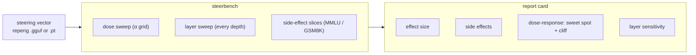

# steerbench

[](https://colab.research.google.com/github/bamdadd/steerbench/blob/main/notebooks/steerbench_quickstart.ipynb)
&nbsp;·&nbsp; MIT &nbsp;·&nbsp; no GPU needed for the report card

> **The report card for steering vectors** — effect size, side effects, a dose-response curve, and per-layer sensitivity for any concept direction.


*A real Qwen2.5-7B formality vector. Effect changes with the injection
coefficient while perplexity holds — then falls off the **coherence cliff**.
steerbench marks the sweet spot and the cliff automatically.*

## Quickstart

Render the four-part card from a repeng vector — CPU-only, no model download:

```bash
git clone https://github.com/bamdadd/steerbench.git && cd steerbench
uv sync --extra vectors --extra report
uv run steer-report data/examples/formality_qwen2.5-7b.gguf --out report_out
open report_out/report.html          # the four-part card (self-contained HTML)
```

`steer-report` summarises the vector (per-layer norms), then reads the committed
sweep CSVs in `artifacts/` and renders the card on CPU. Drop the vector argument
to render from the CSVs alone. Zero-install alternative: the
[Colab notebook](notebooks/steerbench_quickstart.ipynb) (badge above) does the
same in well under 10 minutes.

The GPU sweep that produces the CSVs lives behind `steerbench[gpu]` (Modal),
reached via `steer-report --run <function>`; the core never imports it.

## Pipeline



## How it works (plain language)

**1. A concept is a direction.** As a model reads text, every layer keeps its
running "thoughts" as a big list of numbers — the *residual stream*, a conveyor
belt each layer adds to. A concept like *formality* or *ocean* shows up as a
**direction** in that space. steerbench consumes directions extracted by
[repeng](https://github.com/vgel/repeng) — it does **not** reimplement
extraction.

**2. The nudge has two dials.** You steer by **adding** that direction into the
model's live internal state mid-generation — plain vector addition:

```
current thoughts  +  α · (formality direction)  →  nudged thoughts
```

Two dials: **where** (which layer — depth) and **how much** (`α` — strength).
Pick them wrong and you either get no effect, or you push `α` too high and the
output collapses into repetitive nonsense — the *coherence cliff*.

**3. The problem steerbench solves.** Anyone injecting a concept must choose
**where** and **how much** to nudge *without breaking the model* — and "looks
fine" is not a measurement. steerbench answers it objectively: **dose-response**
sweeps `α` to find the sweet spot and the cliff; the **layer sweep** injects at
every depth to find where the vector actually works (a coherent plateau, versus
the degenerate-trap layers that look strong but are just broken text); and
**side effects** re-check held-out benchmarks (MMLU / GSM8K) so you know the
nudge didn't quietly break everything else.

**The tool exists because the science needed it.**
[introspection-scaling](https://github.com/bamdadd/introspection-scaling) — the
project steerbench was built for — asks whether models can introspect on
*injected* concepts as they scale. To run that cleanly it must inject at a
known-good layer and strength on every model in the ladder. steerbench produces
that report card — the sweet spot, the cliff, the safe layer — so the injection
is **calibrated, not guessed**.

## Results

**M0 — FORMALITY vector on Qwen2.5-7B-Instruct** (repeng PCA-diff over 69
contrastive pairs; 3 seeds; A100 via Modal). Full run in
[M0_REPORT.md](M0_REPORT.md).

- **Dose sweet spot ≈ `alpha_norm` 0.044** (residual-fraction dose; raw coeff
  ≈ 20): formality peaks with coherence still at baseline.
- **Coherence cliffs on both sides** — past coeff ≈ −40 and ≈ +60: repetition
  climbs (0.04 → 0.66) and perplexity spikes as the text degenerates.
- **Layer plateau, peak at layer 17 (0.61 depth).** Measured at equal
  normalized strength across all 27 layers, so an early-layer cliff can't
  masquerade as a peak — the naive fixed-coefficient run flags layer 1 as a
  degenerate trap, which the deconfounded run corrects.

The hero above marks the largest *coherent deflection*, which on this
near-symmetric curve is the casual side (`alpha_norm ≈ −0.055`); the
formality-increasing sweet spot is the `+0.044` above.

Cross-model runs (Llama 3.x 8B, Gemma 2 9B) are in progress — whether
steerability varies by architecture is the finding this chart aims at.

## Scope

Consumes vectors produced by [repeng](https://github.com/vgel/repeng) —
extraction is not reimplemented. Ships benign example concepts (formality,
sentiment, verbosity).

## Related reading

[Two bugs in repeng](https://bamdad.substack.com/p/two-bugs-in-repeng) — the
non-determinism bug found while building steerbench, and the one-line fix
([vgel/repeng#79](https://github.com/vgel/repeng/pull/79)).

## License

MIT.
