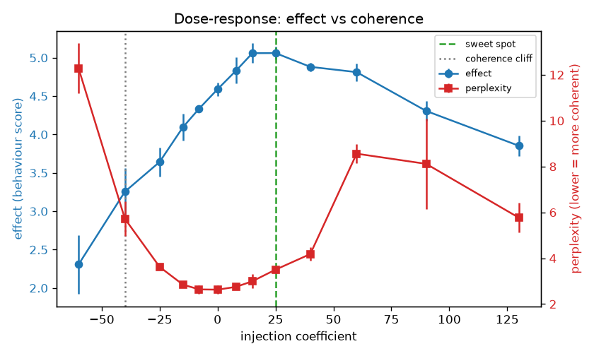
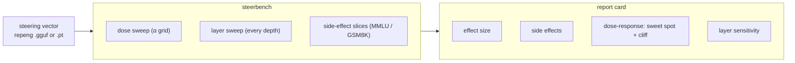

# steerbench

[](https://colab.research.google.com/github/bamdadd/steerbench/blob/main/notebooks/steerbench_quickstart.ipynb)
&nbsp;·&nbsp; MIT &nbsp;·&nbsp; no GPU needed for the report card

> **The report card for steering vectors** — effect size, side effects, a dose-response curve, and per-layer sensitivity for any concept direction.



*A real Qwen2.5-7B formality vector. Effect changes with the injection
coefficient while perplexity holds — then falls off the **coherence cliff**.
steerbench marks the sweet spot and the cliff automatically.*

> The hero stays the real 7B curve — largest dynamic range, and it anchors the
> shape narrative below. For a **one-command, in-repo reproducible** version on a
> cheap T4 (no A100), see the small-model canonical run in
> [`RESULTS.md`](RESULTS.md) via [`experiments/reproduce.sh`](experiments/reproduce.sh):
> Qwen2.5-1.5B and 0.5B reproduce the same interior-optimum dose-response shape,
> and **frac ≈ 0.61 of depth** is a high-effect coherent injection layer on both
> (the argmax on 1.5B; the start of the coherent plateau on 0.5B, whose argmax is
> the last layer — see [`RESULTS.md`](RESULTS.md) for the honest breakdown).

## Quickstart

Render the four-part card from a repeng vector — CPU-only, no model download:

```bash
git clone https://github.com/bamdadd/steerbench.git && cd steerbench
uv sync --extra vectors --extra report
uv run steer-report data/examples/formality_qwen2.5-7b.gguf --out report_out
open report_out/report.html          # the four-part card (self-contained HTML)
```

`steer-report` summarises the vector (per-layer norms), then reads the committed
sweep CSVs in `artifacts/` and renders the card on CPU. Drop the vector argument
to render from the CSVs alone. Zero-install alternative: the
[Colab notebook](notebooks/steerbench_quickstart.ipynb) (badge above) does the
same in well under 10 minutes.

The GPU sweep that produces the CSVs lives behind `steerbench[gpu]` (Modal),
reached via `steer-report --run <function>`; the core never imports it.

## Pipeline



## How it works (plain language)

**1. A concept is a direction.** As a model reads text, every layer keeps its
running "thoughts" as a big list of numbers — the *residual stream*, a conveyor
belt each layer adds to. A concept like *formality* or *ocean* shows up as a
**direction** in that space. steerbench consumes directions extracted by
[repeng](https://github.com/vgel/repeng) — it does **not** reimplement
extraction.

**2. The nudge has two dials.** You steer by **adding** that direction into the
model's live internal state mid-generation — plain vector addition:

```
current thoughts  +  α · (formality direction)  →  nudged thoughts
```

Two dials: **where** (which layer — depth) and **how much** (`α` — strength).
Pick them wrong and you either get no effect, or you push `α` too high and the
output collapses into repetitive nonsense — the *coherence cliff*.

**3. The problem steerbench solves.** Anyone injecting a concept must choose
**where** and **how much** to nudge *without breaking the model* — and "looks
fine" is not a measurement. steerbench answers it objectively: **dose-response**
sweeps `α` to find the sweet spot and the cliff; the **layer sweep** injects at
every depth to find where the vector actually works (a coherent plateau, versus
the degenerate-trap layers that look strong but are just broken text); and
**side effects** re-check held-out benchmarks (MMLU / GSM8K) so you know the
nudge didn't quietly break everything else.

**The tool exists because the science needed it.**
[introspection-scaling](https://github.com/bamdadd/introspection-scaling) — the
project steerbench was built for — asks whether models can introspect on
*injected* concepts as they scale. To run that cleanly it must inject at a
known-good layer and strength on every model in the ladder. steerbench produces
that report card — the sweet spot, the cliff, the safe layer — so the injection
is **calibrated, not guessed**. Concretely: introspection-scaling injects/reads at
**frac ≈ 0.61 of depth**, and steerbench's layer sweep finds that depth to be a
high-effect, coherent formality-injection layer on Qwen2.5-**0.5B, 1.5B and 7B**
— the coherent argmax on 1.5B and 7B, and on the coherent back-half plateau on
0.5B (see [`RESULTS.md`](RESULTS.md)) — so the depth hyperparameter is measured
across a ~14× size range, not assumed.

## Results

One extraction recipe (repeng PCA-diff, 3 seeds, A100 via Modal) run across
models and concepts. Each (model, concept) cell is **n = 1 vector** with coarse
behavioural proxies, so these are **existence** claims, not statistical
interactions. Every effect is measured **within-concept against that cell's own
baseline**; the formality and sentiment proxies are on different scales and are
never compared to each other.

**The finding: architectures differ in dose-response *shape*** — measured on the
coherence-gated `alpha_norm` axis (the residual-fraction dose; model-independent,
unlike the proxy scale):

- **Qwen2.5-7B — interior optimum.** Formality effect rises with dose, peaks
  around `alpha_norm` ≈ 0.04–0.055, then the coherence cliff takes over and the
  effect *reverses* past it (the hero above).
- **Llama-3.1-8B — monotonic-to-cliff.** No interior turn; the best usable effect
  is the *last coherent dose* (`alpha_norm` ≈ 0.197). It needs a **~3–4× higher
  normalized dose** than Qwen (≈ 3.6× vs Qwen formality at ~0.055; ≈ 2.3× vs
  Qwen sentiment at 0.087). A dose tuned on Qwen underdrives Llama. (Llama-3.1-8B
  = NousResearch mirror.)

Both formality vectors behind this are **stable at adequate data** —
injection-layer cosine across re-extractions **0.97 (Qwen)** and **0.83 (Llama)**
at a 90% subsample of the 69 contrastive pairs — so the shape difference is a
real architectural property, not extraction variance. Honest caveat: formality
extraction is **data-hungry** — cosine falls to **0.55–0.64** at a 70% subsample
— so vector stability itself depends on dataset size and should be measured, not
assumed (another face of [vgel/repeng#78](https://github.com/vgel/repeng/issues/78)).

**A cautionary case — the report card catches a bad vector.** On **Mistral-7B**,
the formality dose-response came back **flat in both directions** (positive
`alpha` never clears the 4.83 baseline; negative `alpha` barely moves it despite
downward headroom). That *looks* like "this model won't take formality steering"
— but a re-extraction **stability check** showed why: the formality direction is
**unstable** (injection-layer cosine ≈ **−0.13**, sign-flipping run to run:
−0.81, −0.29, +0.69), a low-SNR vector, not a model property. Crucially, this is
**not** just the data-hunger above: at the *same* 70% subsample the **sentiment**
vector on the *same model* is rock-stable (cosine **0.95**) and steers fine, and
**verbosity** extracts stably too (cosine **0.93**). Mistral extracts two of the
three concepts cleanly and fails on formality alone — so this is not "Mistral is
hard to extract from," it is formality-*specific*. Lesson: a flat curve can
mean *bad vector* or *stubborn model*, and you cannot tell by eyeballing one
generation — the report card plus a stability check distinguishes them. This is
the repeng extraction-instability failure mode
([vgel/repeng#78](https://github.com/vgel/repeng/issues/78)).

**Coherence gates every peak.** We deliberately do *not* headline layer/depth
patterns: Llama's formality peak sits at perplexity ≈ 5.0 (borderline), and
Mistral's apparent formality spike at layer 2 (effect 15.6) lands at perplexity
≈ 8.5 — degenerate text the gate rejects rather than reports as a peak.

Qwen M0 full run: [M0_REPORT.md](M0_REPORT.md). Cross-model sweep complete —
three concepts (formality, sentiment, verbosity) across Qwen2.5-7B,
Llama-3.1-8B, and Mistral-7B (Gemma 2 9B gated, substituted).

## Scope

Consumes vectors produced by [repeng](https://github.com/vgel/repeng) —
extraction is not reimplemented. Ships benign example concepts (formality,
sentiment, verbosity).

## Related reading

[Same recipe, different curves: a vector that lied](https://bamdad.substack.com/p/same-recipe-different-curves-a-vector) —
dose-response shape differs by architecture, and a flat curve can mean a broken
vector rather than a stubborn model; the report card tells them apart.

[Two bugs in repeng](https://bamdad.substack.com/p/two-bugs-in-repeng) — the
non-determinism bug found while building steerbench, and the one-line fix
([vgel/repeng#79](https://github.com/vgel/repeng/pull/79)).

## Contributing

Contributions welcome — start with the [good first issues](https://github.com/bamdadd/steerbench/labels/good%20first%20issue)
(each has file:line pointers and acceptance criteria). See
[CONTRIBUTING.md](CONTRIBUTING.md) for setup and the checks a PR must pass.

## License

MIT.
