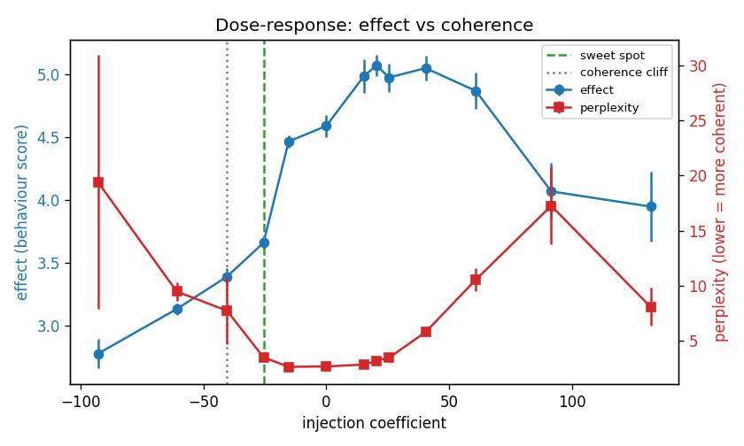
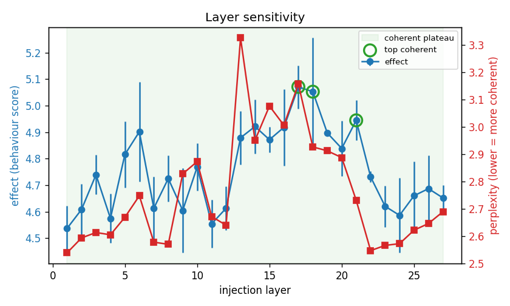

# Steering report card

## Dose-response (hero)

- Baseline (coeff 0.000): effect 4.590, perplexity 2.627.
- Peak effect shift -1.812 (±0.118) at coeff -92.900.
- Sweet spot at coeff -25.548: effect shift -0.930, perplexity 3.456.
- Coherence cliff onset at coeff -40.412.

## Effect size

| coeff | effect | ± | perplexity | repetition |
|---|---|---|---|---|
| -92.900 | 2.778 | 0.118 | 19.411 | 0.298 |
| -60.850 | 3.133 | 0.046 | 9.449 | 0.103 |
| -40.412 | 3.391 | 0.071 | 7.705 | 0.047 |
| -25.548 | 3.660 | 0.048 | 3.456 | 0.040 |
| -15.329 | 4.466 | 0.048 | 2.588 | 0.046 |
| 0.000 | 4.590 | 0.090 | 2.627 | 0.039 |
| 15.329 | 4.987 | 0.136 | 2.796 | 0.041 |
| 20.438 | 5.071 | 0.081 | 3.156 | 0.028 |
| 25.548 | 4.975 | 0.113 | 3.421 | 0.035 |
| 40.412 | 5.050 | 0.100 | 5.759 | 0.030 |
| 60.850 | 4.868 | 0.143 | 10.530 | 0.061 |
| 91.507 | 4.069 | 0.226 | 17.250 | 0.182 |
| 131.918 | 3.948 | 0.276 | 8.049 | 0.503 |

## Side effects (steered vs unsteered)

| benchmark | unsteered | steered | Δ |
|---|---|---|---|
| mmlu | 0.567 | 0.608 | 0.042 |
| gsm8k | 0.544 | 0.467 | -0.078 |

## Layer sensitivity

- Coherent plateau: layers 1–27 (27 of 27 layers); best effect at layer 17 (depth 0.63, effect 5.071, perplexity 3.156).
- Top 3 coherent layers by effect: layer 17, layer 18, layer 21.
